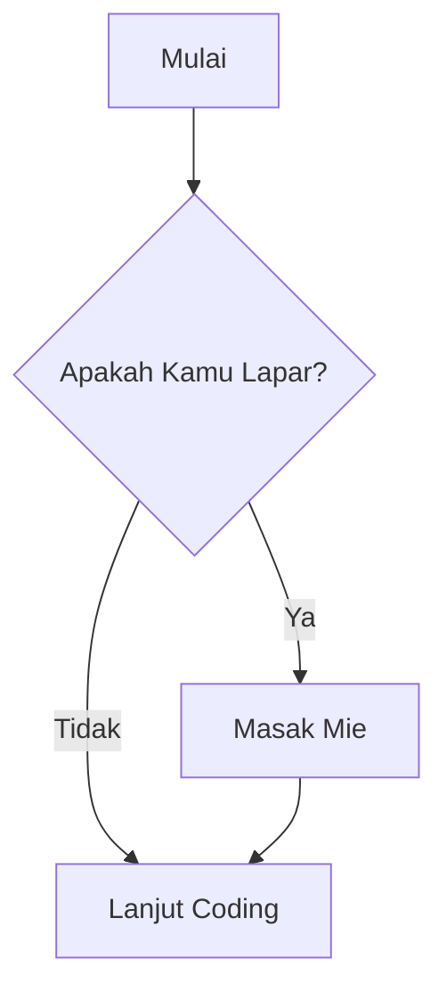

# 🎓 Masterclass Markdown Obsidian: Dari Nol ke Expert

Dokumen ini berisi semua fitur Markdown standar dan fitur khusus Obsidian yang harus kamu kuasai.

---

## 1. Metadata (Frontmatter)
Bagian di paling atas dokumen (di atas garis ini) adalah **Metadata**. 
- **Fungsi:** Mengatur identitas catatan agar bisa dibaca oleh plugin (seperti Dataview) dan sistem pencarian.
- **Syarat:** Wajib diletakkan di baris ke-1 dan dibungkus dengan tiga strip `---`.

---

## 2. Struktur Dasar Teks
*   **Tebal**: `**Teks**` → **Tebal**
*   **Miring**: `*Teks*` → *Miring*
*   **Coret**: `~~Teks~~` → ~~Coret~~
*   **Stabilo**: `==Teks==` → ==Stabilo==
*   **Garis Pembatas**: Ketik `---` di baris baru.

---

## 3. Daftar Lengkap Callouts (Visual Blocks)
Callouts sangat berguna untuk membedakan jenis informasi. Gunakan format `> [!type]`.

> [!note] Note: Informasi tambahan yang santai.

> [!abstract] Abstract: Ringkasan atau TL;DR (alias: `summary`, `tldr`).

> [!info] Info: Informasi penting yang perlu diketahui.

> [!todo] Todo: Daftar tugas (checklist).

> [!tip] Tip: Saran atau cara yang lebih efisien (alias: `hint`).

> [!success] Success: Laporan keberhasilan (alias: `check`, `done`).

> [!question] Question: Pertanyaan atau FAQ (alias: `help`).
>
> [!warning] Warning: Peringatan keras agar berhati-hati.

> [!failure] Failure: Laporan kesalahan atau kegagalan (alias: `fail`, `missing`).

> [!danger] Danger: Bahaya kritis (alias: `error`).

> [!bug] Bug: Masalah teknis dalam sistem/kode.

> [!example] Example: Contoh kasus atau ilustrasi.

> [!quote] Quote: Kutipan dari tokoh atau buku.

---

## 4. Koneksi Antar Catatan (Zettelkasten Style)
Obsidian bukan sekadar file teks, tapi jaringan ide.

*   **Internal Link**: [[Nama Catatan]]
*   **Nama Samaran (Alias)**: [[Nama Catatan|Teks yang Muncul]]
*   **Link ke Judul**: [[Nama Catatan#Nama Judul]]
*   **Link ke Paragraf (Block)**: [[Nama Catatan#^id-paragraf]]
*   **Embed (Menanam Isi)**: ![[Nama Catatan]] (Tambahkan tanda seru agar isinya muncul di sini).

---

## 5. Matematika & Simbol (LaTeX)
Untuk menulis rumus atau simbol teknis yang tidak ada di keyboard.

*   **Satu Baris**: `$E = mc^2$` → $E = mc^2$
*   **Tidak Sama Dengan**: `$a \neq b$` → $a \neq b$
*   **Blok Besar**:
$$x = \frac{-b \pm \sqrt{b^2 - 4ac}}{2a}$$

---

## 6. Kode (Programming)
Sebagai programmer, ini fitur wajib:

**Inline Code**: Gunakan backtick tunggal untuk perintah singkat seperti
`git pull origin main`.

**Code Block**: Gunakan tiga backtick ( \` ) diikuti nama bahasa pemrograman.
```python
# Contoh Python
jenis_catatan='zettelkasten'
app='obsidian'

print(f"saya menggunakan {jenis_catatan} dengan aplikasi: {app}")
```

## 7. Manajemen Tugas (Checkboxes)
Di Obsidian, checkbox bukan sekadar teks, tapi bisa berinteraksi dengan plugin seperti 'Tasks'.

- [ ] Tugas yang belum dilakukan
- [/] Tugas yang sedang dikerjakan (In Progress)
- [x] Tugas yang sudah selesai
- [-] Tugas yang dibatalkan (Cancelled)
- [>] Tugas yang ditunda (Postponed/Scheduled)
- [ ] Tugas yang sangat penting (Urgent)

> [!tip] Shortcut
> Tekan `Ctrl + Enter` saat kursor berada di baris daftar untuk mengubahnya menjadi checkbox secara instan. Tekan lagi untuk mencentangnya.


---

## 8. Komentar (Comments)

%%Ini adalah komentar.%%
<!-- Komentar -->
<!--
Komentar ini bisa multi-baris
-->
---

## 9. Diagram Dasar (Mermaid)
Obsidian mendukung **Mermaid.js**, yang artinya kamu bisa membuat alur logika atau flowchart hanya dengan teks. Ini sangat berguna untuk merancang alur cerita anak atau alur kode Python.



## 10. Tabel (Data Tabular)
Tabel di Markdown menggunakan simbol pipa `|` sebagai pembatas kolom dan strip `-` untuk memisahkan judul (header).

| Nama Kolom 1 | Nama Kolom 2 | Penjelasan |
| :--- | :---: | ---: |
| Teks Rata Kiri | Rata Tengah | Rata Kanan |
| Baris 1 | Data A | Rp 10.000 |
| Baris 2 | Data B | Rp 20.000 |

> [!tip] Tip Tabel
> - `:---` = Rata kiri (Default)
> - `:---:` = Rata tengah
> - `---:` = Rata kanan


---

## 11. Pencarian Internal (Search Link)
Kamu bisa membuat link yang jika diklik akan otomatis menjalankan pencarian di seluruh vault kamu. Sangat berguna untuk menghubungkan topik besar.

- [Cari semua catatan bertema Islam](obsidian://search?query=tag:#islam)
- [Cari semua tugas yang belum selesai](obsidian://search?query=-%20[ ] )
- 

---


## 12. URL Langsung (Autolink)
Jika kamu malas memberi nama teks, cukup bungkus URL dengan tanda kurung siku lancip (opsional di Obsidian, karena Obsidian otomatis mengenali link).
*   **Sintaks:** `<URL>`
*   **Contoh:** <https://balungpisah.id/>
